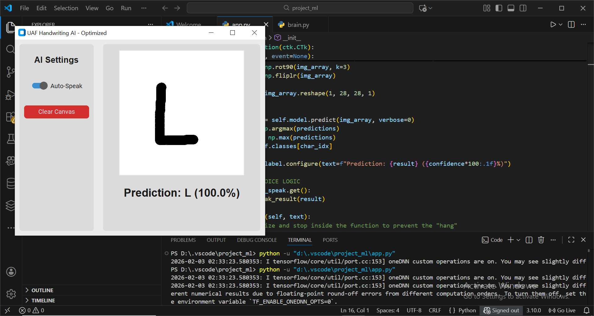
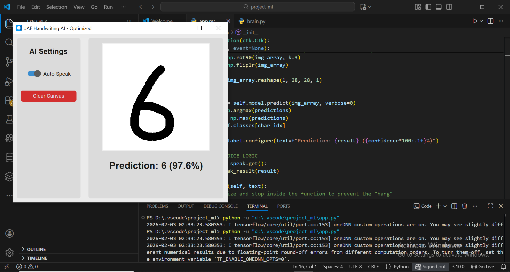

# ✍️ Offline Handwritten Character Recognition Desktop App

A standalone desktop application that recognizes handwritten letters (A-Z, a-z) and digits (0-9) in real-time using a Convolutional Neural Network (CNN). **Works completely offline** with 93%+ accuracy.

## 🎥 Demo
 
 

## 📖 Table of Contents
- [Getting Started](#getting-started)
    - [Step 1: Install Python 3.10.0 or higher version](#step-1-install-python-3.10.0)
    - [Step 2: Install Required Libraries](#step-2-clone-the-repository)
    - [Step 3: Install Required Libraries](#step-3-install-required-libraries)
    - [Step 4: Train the Models](#step-4-train-the-models)
    - [Step 5: Run the App](#step-5-run-the-app)

## 📂 Project Structure

The project should be organized with the following folder and file structure. **Do not rename the data files.**

```
deep-learning-handwritten-recognition/
│
├── app/
│   └── app.py
│
├── assets/
|   ├── 6.png
|   └── L.png
|    
├── training/
|   └── brain.py
|
├── handwriting_model.py
├── README.md
└── requirements.txt
```

## 🧰 System Requirements

| Requirement | Details |
| :--- | :--- |
| **Python Version** | **3.10 or above** (Crucial for compatibility) |
| Operating System | Windows / Linux / macOS |
| Internet Access | Required only for initial library installation |

## 🚀 Getting Started

Follow these steps to set up the project, train the models, and run the visualization application.

### Step 1: Install Python 3.10.0

It is essential to use the specified Python version for library compatibility.

1.  Download Python 3.10.0 from the official website: [https://www.python.org/downloads/](https://www.python.org/downloads/)
2.  During the installation process, ensure you check the box for **`Add Python to PATH`**.
3.  Verify the installation by opening a terminal or command prompt and running:

    ```bash
    python --version
    ```

    The output should confirm the version: `Python 3.10.0`.

### Step 2: Clone the repository

    ```bash
    git clone https://github.com/yourusername/deep-learning-handwritten-recognition.git
    cd deep-learning-handwritten-recognition
    ```

### Step 3: Install Required Libraries

Ensure the `requirements.txt` file is present in the root directory.

1.  Upgrade `pip` and install all required libraries:

    ```bash
    pip install --upgrade pip
    pip install -r requirements.txt
    ```

    Wait for all packages to install successfully.

### Step 4: Train the Models

Both the digit and letter classification models must be trained before running the application. **Training may take a few minutes depending on your CPU.**

#### 🔤 Train digit annd Letter (EMNIST) Model

Run the following command to train the CNN on EMNIST data:

```bash
python brain.py
```

This script will load the EMNIST dataset, train the classification model, and save the weights (e.g., as `handwriting_model.h5`).

### Step 5: Run the App

Once model is trained and saved, you can launch the interactive visualization application.

```bash
python run app.py
```

it will automatically open the application.

## ✨ Features

- **📝 Real-time Recognition:** Draw any character and get instant predictions
- **🌐 Fully Offline:** No internet connection required after setup
- **🔊 Text-to-Speech:** Optional voice output for predictions
- **🎨 Clean GUI:** Modern interface built with CustomTkinter
- **🧠 Custom CNN:** Model trained from scratch on EMNIST dataset
- **🖱️ Easy to Use:** Simple drawing canvas with clear controls

## 🏗️ Architecture
User Draws → Canvas → Preprocessing → CNN Model → Prediction → Display/Speak
(Tkinter) (PIL/NumPy) (TensorFlow) (Tkinter/pyttsx3)